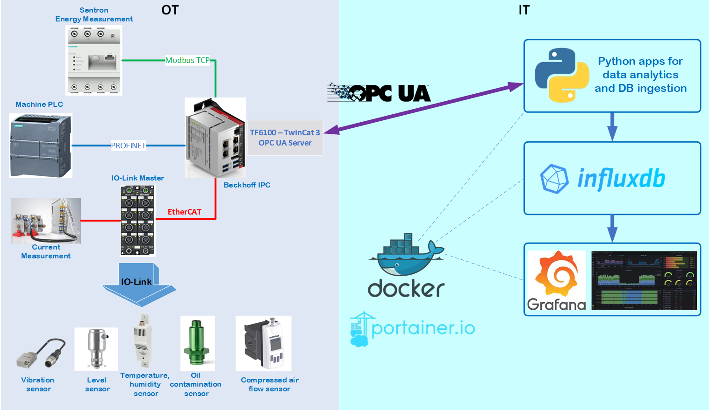

# IIoT Real-Time Analytics using Python, OPC UA and Beckhoff IPC


IIoT project for data exchange between PLC in OT and IT area with usage of OPC UA protocol.  

#### System Diagram


#### General Overview
Using this framework it's possible to collect data from different sensors, PLCs and devices in OT area. The collected data are preprocessed in Beckhoff IPC (acts as OPC UA server), converted into OPC UA structures as `StructuredType` and can be polled by any OPC UA client.

In IT area, there are couple of containerized  applications which runs using Docker (Docker-Compose) and Portainer.
Python apps (as opc ua clients) request data from Bechkoff IPC (as opc ua server) and perform analytics, anomaly detection in sensor signals and finally save the results in time series database InfluxDB. 
The graphical results are visible as dashboards in Grafana.


#### Detailed description:
Folder `apps` includes:
* `global`
* `industrial_line1`

`global` is the main component which runs InfluxdB, Grafana, Portainer - all of them as Docker containers. This stack should be always in operation and is prerequisite for deploying respective plant/production line.  

`industrial_line1`  - multiple Python apps as Docker containers. Some Python applications are quite simple and just poll OPC UA data and ingest them directly in proper format into InfluxDB. Other are more complex and include anomaly detection (z-score method) on sensor signals.
The file `industrial_line.yml` for docker-compose can be composed of many single entries for each Python app. Respective `docker-compose` config for each Python app can be found in folder  `/src/subfolder_for_python_app`   

This stack should be launched after `global` is fully deployed and in operation.

Folder `apps_data` are persistance configs and data from Grafana, InfluxDB, OPC UA config, Portainer and Prometheus. These are mounted as Docker bind mounts.

Folder `docs` includes photos ans pictures for documentation

Folder `opcua` includes security certificates for OPC UA connection and `config.json` files which include configuration(url for OPC UA server and signal/status list for interrogation) for respective Python apps. 

Folder `src` consists of multiple Python apps which can be deployed as Docker containers. Following apps are available:

* `air_valve_anomaly_detect_zscore` - polls air valve travel times over OPC UA, calculates anomaly using z-score method and stores results to InfluxDB
* `electrical_anomaly_analytics_zscore` - 
calculates analytics like definite integral of electrical current over fixed time, electrical current assymetry and inrush current. Z-Score anomaly detection algorithm is then applied to integral and inrush current 

* `multiple_signal_monitor` - 
polls data over OPC UA from multiple sensors and stores its values into InfluxDB

* `multiple_state_monitor` - 
polls data over OPC UA from multiple states in production line and stores its values into InfluxDB

* `single_signal_anomaly_detect_zscore` - polls data over OPC UA from single sensor, apply z-score anomaly detection algorithm on its value and store the results and timestamp into InfluxDB.

* `single_signal_monitor` - polls data over OPC UA from single sensor and store its value and timestamp into InfluxDB.

* `vibration_anomaly_detect_z_score` - polls acceleration data from vibration sensor over OPC UA, calculates anomalies using z-score method and stores results in InfluxDB.


### Setup & Run
The prerequisite is that Docker is installed on the target system.

Start global docker stack:
```
cd /apps/global/build
bash compose_start.sh
```
After all containers from global are running properly, start respective plant/production line. 

In this simplified example it's one industrial line with couple of containers:

```
cd /apps/industrial_line1/build
bash compose_start.sh
```

The IPC Beckhoff should also be running and expose OPC UA data.

