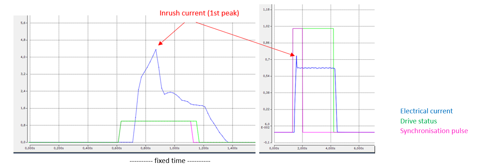
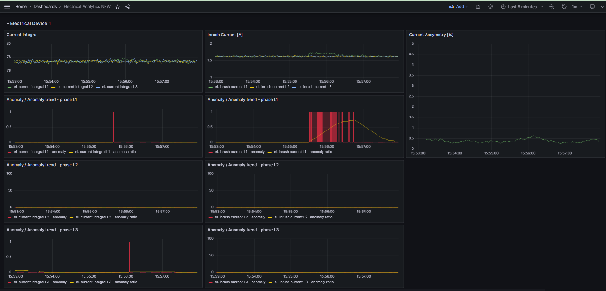

## Anomaly detection with z-score algorithm on electrical device

It polls data from one electrical device over OPC UA.
Based on this, it calculates analytics like definite integral over fixed time,
electrical current assymetry and inrush current.
Anomaly detection algorithm is then applied to
integral value and inrush current.
Analytics results and timestamp are saved in InfluxDB.
It also stores raw electrical data to InfluxDB.

The script subscribes to opc NODE_ID (as string)
and connects to opc ua SERVER_URL (string)

It expects following data structure in NODE_ID:
* line_name `(string)`
* machine_name `(string)`
* device_state `(bool) - Running=TRUE; Stopped=FALSE`
* synch_pulse `(bool) - synchronisation pulse`
* timestamp `(ulint) - as Epoch Unix (13 digits)`
* electrical_data as STRUCT of:

                STRUCT
                    //Power Measurement Data
                    // ************* total measurements ***********
                    ActPowerTot		:REAL;
                    ReactPowerTot	:REAL;
                    ApparPowerTot	:REAL;
                    PowerFact		:REAL;
                    PQF				:REAL;	// power quality factor
                    
                    //************* L1 phase data *****************
                    ActPowerL1		:REAL;
                    ReactPowerL1	:REAL;
                    ApparPowerL1	:REAL;
                    
                    CurrentL1		:REAL;
                    VoltL1			:REAL;
                    PowFactL1		:REAL;
                    VoltL1_THD		:REAL;	// THD of voltage	
                    
                    CurrentL1_THD	:REAL;	// THD of current
                    CurrentL1_Harm	:ARRAY [0..41] OF REAL;	
                    
                    //************* L2 phase data *****************
                    ActPowerL2		:REAL;
                    ReactPowerL2	:REAL;
                    ApparPowerL2	:REAL;
                    
                    CurrentL2		:REAL;
                    VoltL2			:REAL;
                    PowFactL2		:REAL;
                    VoltL2_THD		:REAL;	// THD of voltage
                    
                    CurrentL2_THD	:REAL;	// THD of current
                    CurrentL2_Harm	:ARRAY [0..41] OF REAL;
                    
                    //************* L3 phase data *****************
                    
                    ActPowerL3		:REAL;
                    ReactPowerL3	:REAL;
                    ApparPowerL3	:REAL;
                    
                    CurrentL3		:REAL;
                    VoltL3			:REAL;
                    PowFactL3		:REAL;
                    VoltL3_THD		:REAL;	// THD of voltage
                    
                    CurrentL3_THD	:REAL;	// THD of current
                    CurrentL3_Harm	:ARRAY [0..41] OF REAL;
                END_STRUCT

  

Final result are  visible in Grafana.
Any abnormal behaviour of electrical inrush current and definite integral on electrical current is indicated as anomaly (red bars). However these are only single marks for each data point. For better overview of anomaly amount within a time window there is also anomaly trend available.

