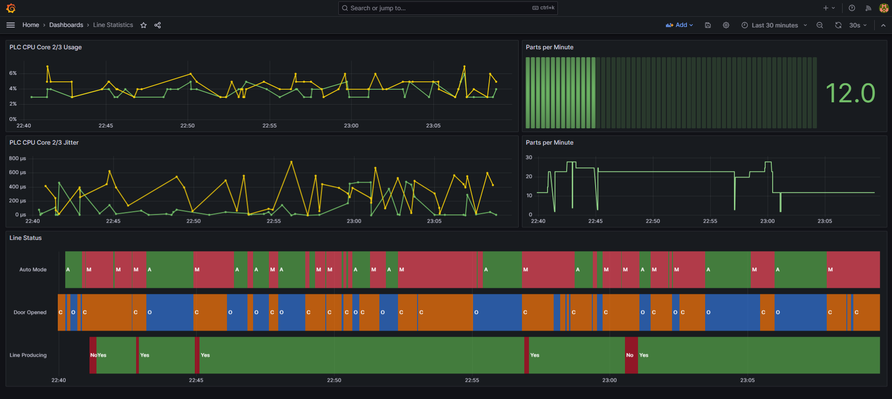

## Multiple state monitor

This script polls multiple states(state value is INT) over OPC UA 
and store its value and timestamp into InfluxDB.

Configuration of namespaces, nodes_id and opc ua server url are in `config.json` file.

It expects following data structure for each NODE_ID:
* line_name `(string)`
* machine_name `(string)`
* state_name `(string)`
* state_value `(float)`
* timestamp `(ulint) - as Epoch Unix (13 digits)`

Examples of production line states (auto/manual, line producing, door opened) are depicted on the screens below: 

