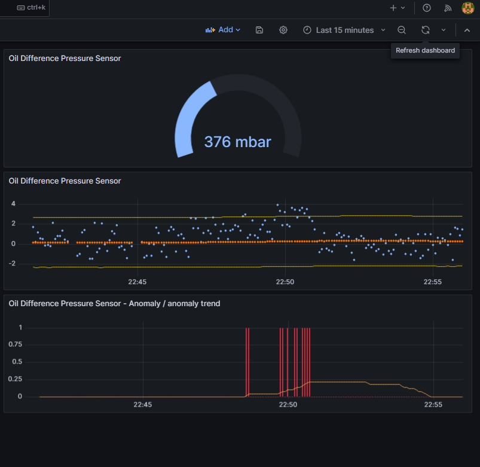

## Anomaly detection with z-score algorithm on single signal

This script polls data over OPC UA from single sensor,
apply z-score anomaly detection algorithm
on its value and store the results
and timestamp into InfluxDB.
The script subscribes to opc NODE_ID (as string)
and connects to opc ua SERVER_URL (string)

It expects following data structure for each NODE_ID:
* line_name `(string)`
* machine_name `(string)`
* sensor_name `(string)`
* sensor_value `(float)`
* timestamp `(ulint) - as Epoch Unix (13 digits)`

Example of anomaly detection for oil contamination sensor is depicted on the screens below.
Anomaly for single data point is marked as red bar. However these are only single marks for each data point. For better overview of anomalies amount within a time window there is also anomaly trend available.

