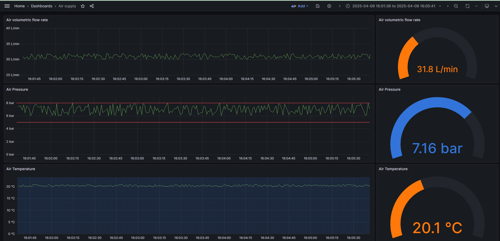

## Single signal monitor

This script polls data over OPC UA from single sensors(sensor value is FLOAT)
and store its value and timestamp into InfluxDB.

The script subscribes to opc NODE_ID (as string)
and connects to opc ua SERVER_URL (string)

It expects following data structure for each NODE_ID:
* line_name `(string)`
* machine_name `(string)`
* sensor_name `(string)`
* sensor_value `(float)`
* timestamp `(ulint) - as Epoch Unix (13 digits)`

Examples of air sensor data are depicted on the below screens:

