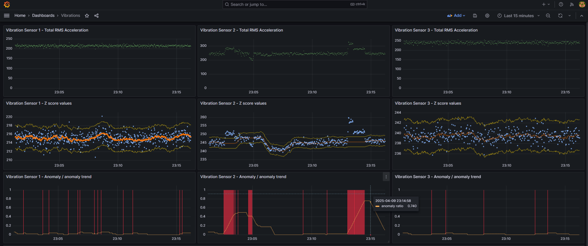

## Anomaly detection with z-score algorithm on vibration sensor

It polls single vibration sensor data (acceleration) over OPC UA.
Next, it calculates anomalies using z-score method and stores results in InfluxDB.

The script subscribes to opc NODE_ID (as string)
and connects to opc ua SERVER_URL (string)

It expects following data structure in NODE_ID:
* line_name `(string)`
* machine_name `(string)`
* sensor_name `(string)`
* vib_accel_rms_x `(float) - rms vibration acceleration in x axis `
* vib_accel_rms_y `(float) - rms vibration acceleration in y axis `
* vib_accel_rms_z `(float) - rms vibration acceleration in z axis `
* sensor_temperature `(float)`
* timestamp `(ulint) - as Epoch Unix (13 digits)`

Final result are  visible in Grafana.
Any abnormal behaviour of vibration acceleration is indicated as anomaly (red bars). However these are only single marks for each data point. For better overview of anomalies amount within a time window there is also anomaly trend available.

